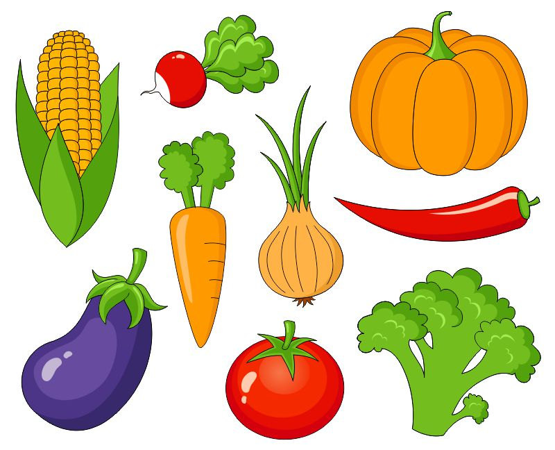

# Name that Crudite!! (Word-Guess-Game)

This readMe is for a hangman-style game as assigned in the Penn LPS Coding Bootcamp. The assignment was to make a functional web page using Javascript that allowed the user to play a game of hangman. The topic and theme of the game were left up to me to choose, so I decided to choose food - specifically fruits and vegetables. The demo of the game can be found here: <a href="https://youtu.be/W-IJcC4tYFI">https://youtu.be/W-IJcC4tYFI</a>.

The instructions specified to keep track of the following on the screen for the user:
<ul style="font-size:16pt">
<li>Number of wins (correct guesses)</li>
<li>Word displayed with _ _ _ _ _ _ </li>
<li>Reveal letters as correct guesses are made ( _ P P _ E )</li>
<li>Number of guesses remaining</li>
<li>Letters the user has already guessed</li>
</ul>

I completed the assignment, and then decided to challenge myself and re-do the assignment in "hard mode" using an object to hold all of the code for the game. Completing the assignment without objects first was very helpful, and I found that moving from non-object to object code did not take me very long, except for going back and fixing all of the errors from object calls I missed. This is the active page. 

 
Thanks!
 
Nathan Hill

